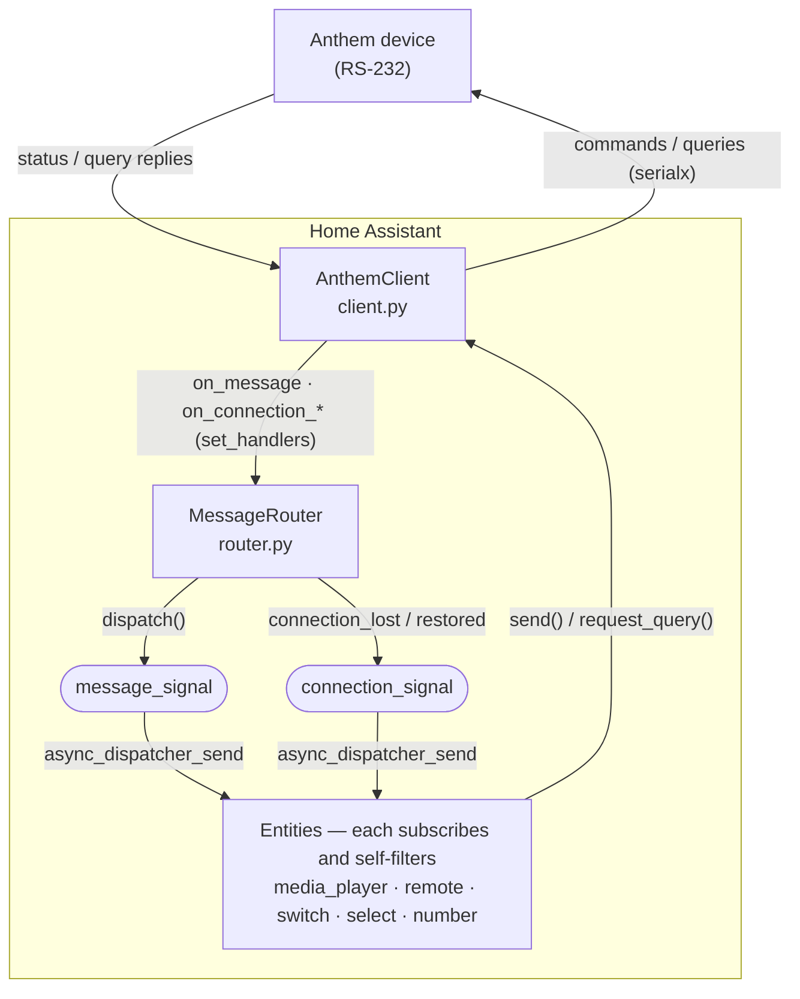

# Architecture

How the `anthemav_serial` integration is put together, for contributors. For the
RS-232 command reference and what's been confirmed on the device, see
[protocol_analysis.md](protocol_analysis.md).

## Overview

One config entry ↔ one device ↔ one `AnthemClient`. The client owns the
transport; a single `MessageRouter` is the client's message/connection handler
and simply **broadcasts** to dispatcher signals; every entity subscribes and
picks out what it cares about.

## Components

### `AnthemClient` (client.py)

Owns the serial/TCP transport via [serialx](https://pypi.org/project/serialx/)
(dispatches on the URL scheme: `socket://`, `rfc2217://`, `esphome://`, or a
device path).

- **Lifecycle:** `start()` connects and launches two background tasks —
  `_supervise` (read loop + reconnect-with-backoff) and `_drain_queries` (the
  paced query pump). `stop()` cancels both and closes the transport.
- **Reading:** `_listen` reads a line at a time, resolves any pending
  `query_one` futures, and calls the message handler. It re-raises
  `CancelledError` so the task dies cleanly on shutdown.
- **Writing:** `send()` is serialized by a lock. `request_query()` enqueues a
  state query drained one per `QUERY_INTERVAL` — a burst of add-time / power-on
  re-queries then trickles out instead of overflowing the device's **64-byte
  incoming buffer**.
- **Callbacks:** `set_handlers(on_message, on_connection_lost, on_connection_restored)`.

### `MessageRouter` (router.py)

Wired as the client's handler in `__init__.async_setup_entry` **before**
`client.start()` and before platforms are forwarded, so no entity's add-time
query reply is lost to a not-yet-wired handler. It is stateless:

- `dispatch(message)` → logs device error replies, then
  `async_dispatcher_send(message_signal, message)`.
- `connection_lost()` / `connection_restored()` → `async_dispatcher_send(connection_signal, False/True)`.

### Dispatcher signals (const.py)

- `message_signal(entry_id)` — carries every raw device message.
- `connection_signal(entry_id)` — carries connection state (`True` up / `False` down).

Using the dispatcher means the router doesn't need to know the entities, and
platforms set up in any order without dropping messages.

### Entities

Every entity, in `async_added_to_hass`, subscribes to **both** signals:

- **message_signal** → `_handle_message` / `_handle_dispatch`, which **self-filters**
  (e.g. a Zone 2 entity acts only on `P2…`; the headphone number on `H…`). The
  media_player zones and tuner do this too — the tuner even self-parses zone
  source messages (`P{z}S/X`) to know when it's on.
- **connection_signal** → `_handle_connection`: go **unavailable** on a drop,
  **re-query** on reconnect (the reply then re-establishes availability, e.g. a
  zone that's off answers with zone-off text).

Platforms:

| Platform | Entities |
|---|---|
| `media_player` | per-zone players (Main/Zone 2/Zone 3) + the Tuner |
| `remote` | per-zone `send_command` surface (disabled by default) |
| `switch` | tone defeat, headphone mute, panel lock, auto timers, triggers |
| `select` | tuner mode, brightness, record output |
| `number` | headphone + per-zone/Main bass/treble/balance/level trims |

### Device topology (device.py)

Entities are grouped into sub-devices hanging off a processor parent via
`via_device`: **Processor**, **Main**, **Zone 2**, **Zone 3**, **Tuner**,
**Headphone**. A user can disable an unused zone/feature as a whole.

## Lifecycle / message flow

**Startup** (`async_setup_entry`): create `AnthemClient` → create `MessageRouter`
→ `set_handlers` → `start()` (connect + read loop) → `async_forward_entry_setups`.
Each entity subscribes and issues its initial query; replies arrive via the
router broadcast.

**Runtime:** the device pushes a status message on any change → `router.dispatch`
→ broadcast → the interested entity updates. State is push-driven; no polling.

**Outage:** the read loop detects the drop → `on_connection_lost` → router
broadcasts `connection_signal(False)` → all entities go unavailable, while
`_supervise` retries with backoff. On success → `on_connection_restored` →
`connection_signal(True)` → entities re-query and repopulate.

## State conventions

- **Queryable** entities start unavailable until the first reply.
- **Zone-power-tracked** entities (zone media_players, tone defeat, record
  output, Main/zone trims) go unavailable while their zone is off — the device
  answers a query for an off zone with zone-off text (`Main Off`, …).
- **Write-only** controls (front-panel brightness, panel lock, triggers) have no
  device query, so they use `RestoreEntity` to restore their last value across
  restarts rather than coming up unknown.

## Config flow & options (config_flow.py)

The user picks a connection type (network socket / RFC 2217 / ESPHome / local
serial); the entry stores a serialx URL + baud. Reconfigure swaps the connection
while preserving a stable internal `id` (there's no hardware serial number), so
device + history survive. Options cover source rename/hide, per-zone volume
limits, clock format, and the opt-in trigger control.

## Services

`sync_time` is registered once in `async_setup` (domain-wide, not per entry). It
broadcasts: syncs every loaded entry to HA's current time, each using its own
clock-format option, and errors if none are loaded.

## Testing

Unit tests run without hardware against a mocked `AnthemClient`
(`tests/conftest.py`): the router (`test_message_router.py`), each platform, the
connection outage/reconnect path (`test_connection.py`), and the client itself
(`test_client.py`). CI runs ruff + the full suite; hassfest + HACS validate
separately. The `scripts/probe_*.py` tools talk to a real device to confirm
protocol behavior.
